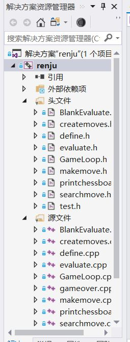

可执行文件在bin中,双击运行,具体使用可参见程序内提示

报告在report文件夹中

## 代码运行

### windows 平台

windows平台请打开code中sln文件，并右键点击**renju**,选择属性，在其中修改“平台工具集”和“Windows SDK 版本”到您电脑对应的版本

### windows 及其他平台

请您在 `code/renju`文件夹内用`cmake`运行`CmakeList.txt`，然后就能运行了

