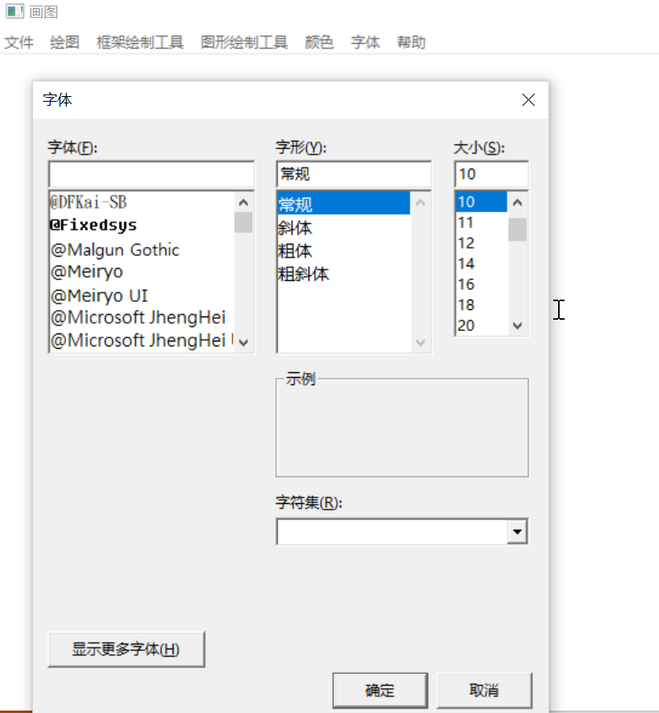
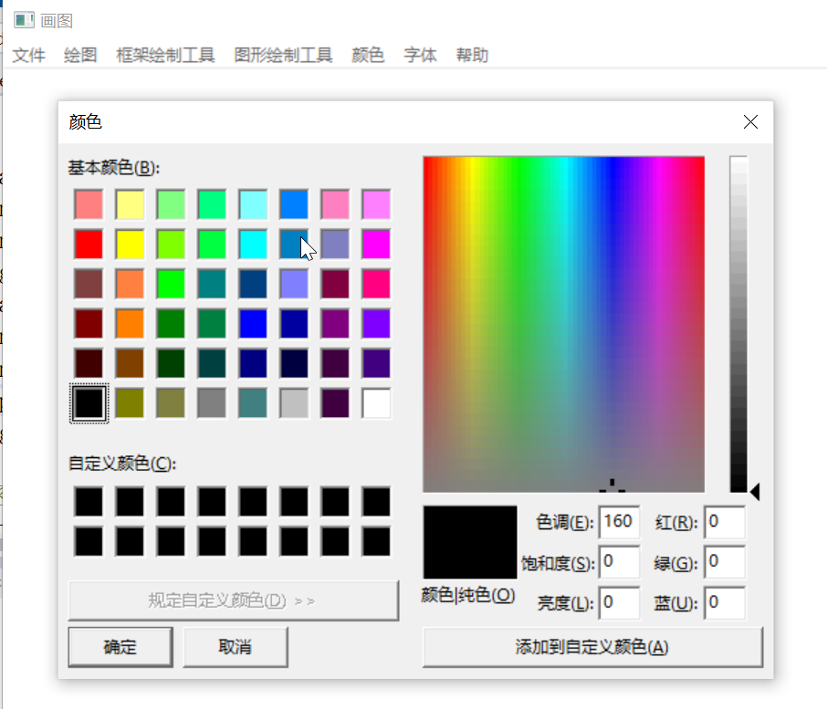

## PictureEditor

# 汇编与编译原理大作业

### 1. 开发环境

#### windows10下VS2017+masm32

+ 常规 > windows SDK版本：**10.0.17134.0**

+ 常规 > 平台工具集：**Visual Studio 2017 (V141)**

+ 链接器> 附加库目录：**~/masm32/bin;**

  链接器 > 系统 > 子系统：	**窗口(/SUBSYSTEM:WINDOWS)**

+ Microsoft  Macro Assemble > General > **~/masm32/include;**

### 2.实现原理

- 整体框架
  - 基于老师上课讲的Win32框架
  - 通过处理WM_COMMAND事件来响应菜单操作，更改当前绘图模式
  - 通过处理单击事件（这里用的是WM_LBUTTONUP）来进行取点
  - 通过综合处理WM_LBUTTONDOWN,WM_LBUTTONUP,WM_MOUSEMOVE事件来实现画笔和橡皮
  - 每次触发绘图操作时保存数据，然后调用InvalidateRect函数来触发绘图操作。处理WM_PAINT事件来绘制

+ 创建窗口

  - 用CreatePopupMenu函数创建窗口，用AppendMenu绑定对应的文字描述和模式

+ 框架画图

  + 实现了直线、矩形、三角形（分上下）、多边形
  + 直线可调整类型，PS_SOLID(实线), PS_DASH(段线),PS_DOT(点线), PS_DASHDOT(线、点),.... 等共6种
  + 直线可调整粗细，调用GetDlgItemInt函数输入直线粗细值，调整粗细
  + 直线可调整颜色，通过选择颜色可修改PenColor
  + 矩形，确定两个点以对角的两点，画出四条直线
  + 三角形，原理同矩形
  + 多边形：每选中一个点，就连出一条新线。然后判断当前最新选中的点是否和初始点足够接近，如果足够接近就结束取点，闭合绘制。

+ 图形

  + 实现了矩形、三角形、多边形、椭圆，用GDI自带的函数绘制
  
  + 其外边距默认借用前面框架直线的设置
  
  + 内部填充可选颜色
  
  + 内部填充可选类型，有实心，(斜)交叉，左右斜线，竖/平线
  
  + 截图如下，有画笔绘制，各种线，各种线框，各种图形，橡皮擦，文字
  
    
  
+ 文本

  + 调用IDialogBoxParam创建输入文本窗口，获取文本

  + 字体 IHandleFont函数实现

  >  1. 定义全局变量CurrentFont，为HFONT句柄，存储当前的字体；
>  2. 使用ChooseFont函数调用字体选择对话框，将选择的字体存入句柄；
>  3. 当进行文本构建时，直接将CurrentFont作为句柄选择（SelectObject）进入当前HDC(ps.hdc)；
>  4. CurrentFont作为全局句柄变量无需Delete。
>  5. 截图：

  

+ 颜色

  + 颜色：IHandleColor函数实现，
  > 1. 存在两种颜色，PenColora和BrushColor，分别作为全局DWORD存储。
  > 2. 使用ChooseColor调用颜色选择对话框，将对应的颜色存入
  > 3. 当需要绘制时，通过CreatePen或者CreateSolidBrush/CreateHatchBrush创建对应的hPen或者hBrush句柄。SelectObject选择进入当前HDC(ps.hdc)
  > 4. 当前创造的句柄需要Delete(DeleteObject)。
  
  + 颜色截图
  
  
  
  橡皮大小和线宽度选择
  
  - 线宽度：IHandlePainterSize函数实现，橡皮大小：IHandleEraserSize函数实现
  
  > 1. 通过对话框DialogBoxParam输入大小
  > 2. 使用GetDlgItemInt获取输入的整数，并且进行范围判断
  > 3. 当需要绘制时，通过CreatePen创建对应线宽的hPen句柄。SelectObject选择进入当前HDC(ps.hdc)
  > 4. 当前创造的句柄需要Delete(DeleteObject)。
  > 5. 在使用橡皮擦的时候，把对应大小的正方形区域用NULL_PEN绘制
  
  - 截图
  
  
  
  
  
  文件保存
  
  + 文件保存：IHandleModeChange（）内直接实现
  > 1. 支持将画布内容保存为BMP图片格式；
  > 2. 认识到BMP图片格式文件由位图文件头、信息头、调色板和位图数据四部分组成；
  > 3. 通过CreateCompatibleBitmap、CreateCompatibleDC、SelectObject、BitBlt等多个函数将窗口中的位图信息转移到自己创建的环境中的位图上，再通过GetObject函数即可获取到位图信息，再利用GetDIBits函数将位图信息转移到分配的内存中区；
  > 4. 根据位图信息中像素、色深等信息完成位图文件头、信息头和调色板相关数据计算，同时给文件头和信息头赋上合适的值；
  > 5. 通过CreateFile和WriteFile函数即可完成文件的创建和信息的传入
  
  文件读取
  
  + 文件读取：IHandleModeChange（）内直接实现
  > 1. 通过LoadImage函数载入bmp图片文件；
  > 2. 再通过BitBlt将位图信息传输到窗口，即可对以前保存的文件进行进一步绘制；
  
  
  
  
  
  

### 3. 难点和创新点

- 如何实现画笔操作？

> 画笔操作，实际是画线。
>
> 当鼠标按下时，进入绘制状态。收起时，退出绘制状态。
>
> 在绘制时，每次触发到WM_MOUSEMOVE事件时，都从先前的鼠标位置画线到当前位置，然后把当前位置作为新的先前鼠标位置。逻辑如下
>
> ```assembly
> 	mov edx, CurrentX
> 	mov ebx, CurrentY
> 	mov ecx, CurrentMode
> 	.IF MouseStatus == 1
> 		.IF ecx == IDM_MODE_DRAW    ;画线
> 			;更新画线位置 
> 			.IF EndX == 0  ;第一次画线
> 				mov StartX, edx
> 			.ELSE
> 				mov eax, EndX
> 				mov StartX, eax
> 			.ENDIF
> 			
> 			.IF EndY == 0 ;第一次画线
> 				mov StartY, ebx
> 			.ELSE
> 				mov eax, EndY
> 				mov StartY, eax
> 			.ENDIF
> 
> 			mov EndX, edx
> 			mov EndY, ebx
> 			INVOKE InvalidateRect, hWnd, ADDR WorkRegion,0
> 		.ELSEIF ecx == IDM_MODE_ERASE ;擦除
> 			INVOKE InvalidateRect, hWnd, ADDR WorkRegion, 0
> 		.ENDIF
> 	.ENDIF
> ```
>
> 其中StartX/Y，EndX/Y是绘制函数的画线起止点。
>
> 如果没有记录先前的鼠标位置，就从当前位置画线到当前位置。否则从先前位置画线到当前位置。

- 如何实现绘制线/线框/多边形？

> 直线，矩形，三角形，椭圆只需要两个点确定，而多边形需要n个点才能确定。因此，我仿照C++的不定长数组，通过一个很大的数组+长度记录，实现了点列数据结构。
>
> 当鼠标按下时，进入绘制状态。收起时，退出绘制状态。
>
> 在绘制时，每次触发到WM_MOUSEMOVE事件时，都从先前的鼠标位置画线到当前位置，然后把当前位置作为新的先前鼠标位置。逻辑如下
>
> ```assembly
> ;当前使用的点信息
> CurrentPointNum DWORD 0
> CurrentPointListX DWORD 100 DUP(?)
> CurrentPointListY DWORD 100 DUP(?)
> ```
>
> 每处理一个单击事件，就存一个点。
>
> 如果是绘制直线，矩形，三角形，椭圆，就存到2个点触发绘制函数，绘制完毕设置点数量为0
>
> 如果是绘制多边形，就每存一个点，判断和第一个点的距离。当足够接近，就触发绘制函数，绘制完毕设置点数量为0
>
> 绘制线框时，通过已有点的数据算出其他点的数据，然后相当于一下画多条线。
>
> 绘制图形时，用汇编GDI的自带函数进行绘制。
>
> ```assembly
> 	INVOKE Rectangle, hdc, CurrentX, CurrentY, ebx, edx
> 	INVOKE Ellipse, hdc, edx, ecx, ebx, eax
> 	INVOKE Polygon, hdc, ADDR CurrentPointList, CurrentPointNum
> ```

+ 选择颜色后如何赋给直线以及填充区域？

> 这需要对于handle句柄以及DC设备上下文有一定的了解
>
> 在绘图时，需要传输DC的句柄hDc至绘图函数中，这样绘图才会成功呈现在当前设备上
>
> 于是，hDc添加多个可选内容，如Brush, Pen, Erase, Bitmap等，以此来调整画图的模式
>
> 对于直线来说，Pen可以通过CreatePen创造；
>
> 对于填充区来说，Brush通过调用CreateSolidBrush/CreateHatchBrush创造
>
> ```assembly
> invoke CreatePen, PenStyle, PenWidth, PenColor ;返回句柄hPen到eax
> invoke CreateSolidBrush, BrushColor
> invoke CreateHatchBrush, HatchStyle, BrushColor;返回句柄hBrush到eax
> ```
>
> 接着，我们将句柄传入到hDc当中即可
>
> ```assembly
> invoke SelectObject, hDc, eax ;此时eax存储在对应的句柄，若想传入多个对象到DC,则需重复多次。
> ```
>
> 最终，通过传输hdc到画图函数中，会自动进行颜色等的改变
>
> ```assembly
> invoke DeleteObject,hPen;此外，必须Delete掉新创造的句柄，否则会出现一些奇怪的错误 
> ```

+ 如何获取窗口中的位图信息？

> 这需要用到win32多个函数的帮助；
>
> 首先要考虑如何能够将窗口的位图信息移出来编程可以使用的数据；
>
> 通过CreateCompatibleBitmap、CreateCompatibleDC可以创建一个新的位图和上下文环境；
>
> 再通过SelectObject即可将新创建的位图移到新创建的上下文环境中；
>
> GetDC可以获取窗口句柄，BitBlt即可通过该句柄将其位图信息覆盖新创建的位图，达到取出位图信息的功能；
>
> GetObject则通过该位图信息获得BITMAP形式的信息加以利用；
>
> 而GetDIBits函数最后将位图信息直接移到分配的内存中，这样就可以直接输出位图信息了。

### 4. 小组分工

#### 1. 沈冠霖：

1. 基本框架

2. 基本的上方菜单

3. 能画线，擦除，绘制基本图形，绘制文字

4. 修改光标

#### 2. 张小健：

1. 实现选择字体，文字大小，字体，（暂无颜色）。
2. 选择颜色：填充颜色和线条颜色
3. 选择填充模式：实心等多种模式
4. 设置线条宽度，线条类型

#### 3. 邓坤恬

1. 文件的保存
2. 文件的读取

### 5.代码结构

Define.inc --常量和各种函数定义

main.asm --窗口主程序

Painter.asm --各种绘图程序

MenuAndControl.asm --菜单和控制部分，包括菜单建立和对话框程序

WindowsManager.asm --各种事件处理，包括绘图事件，WM_COMMAND事件，鼠标事件，存/读事件，修改绘图模式事件

Resource.rc--资源文件，资源本身放到res文件夹里

### 6.参考资料

GDI文档 http://www.yfvb.com/help/gdiplus/index.htm?page=gdipdrawline.htm

Windows API文档 https://docs.microsoft.com/en-us/windows/win32/apiindex/windows-api-list

对话框使用 https://blog.csdn.net/qq_22642239/article/details/51203396

一个demo程序 https://github.com/nero19960329/DrawingTool/blob/master/Main.asm 